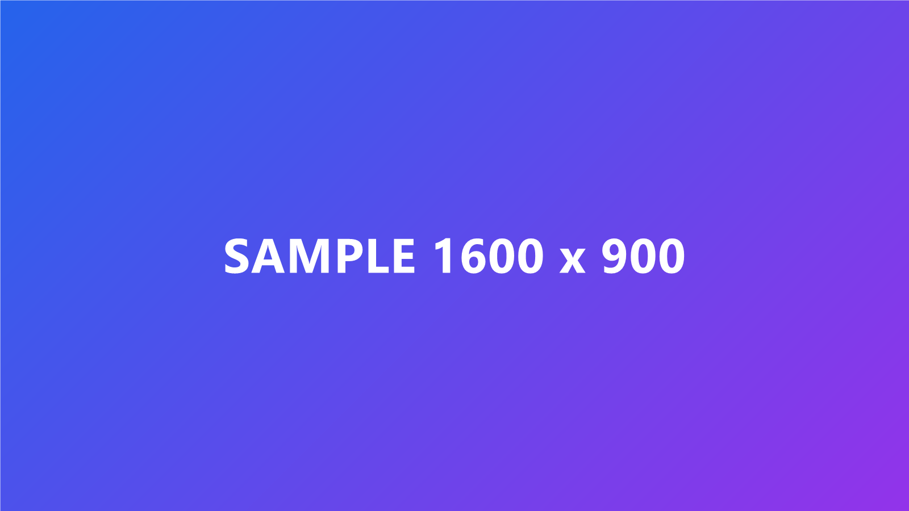

+++
title = "샘플 글 — page bundle 이미지 테스트"
date = 2026-07-27T00:00:00+09:00
draft = true
tags = ["hugo", "sample"]
categories = ["기타"]
summary = "page bundle 구조에서 상대경로 이미지와 리사이즈 shortcode가 잘 동작하는지 확인하는 샘플 글입니다."
+++

이 글은 **page bundle 구조**를 검증하기 위한 샘플입니다.
`content/posts/hello-world/index.md` 와 같은 폴더에 `sample.png` 가 들어 있습니다.

## 1. 마크다운 상대경로 이미지

아래는 평범한 마크다운 문법으로 같은 폴더의 이미지를 상대경로로 참조한 것입니다.
(원본 그대로 출력됩니다.)



## 2. 리사이즈 shortcode (max-width 1200 + WebP)

아래는 `img` shortcode 로 불러온 것입니다. 원본이 1200px보다 넓으면
자동으로 1200px로 축소되고 WebP로 변환됩니다.



## 3. 코드 블록 (syntax highlighting)

```python
def hello(name: str) -> str:
    return f"안녕하세요, {name}님!"


print(hello("시헌"))
```

위 세 가지가 모두 정상 렌더링되면 세팅이 완료된 것입니다.
