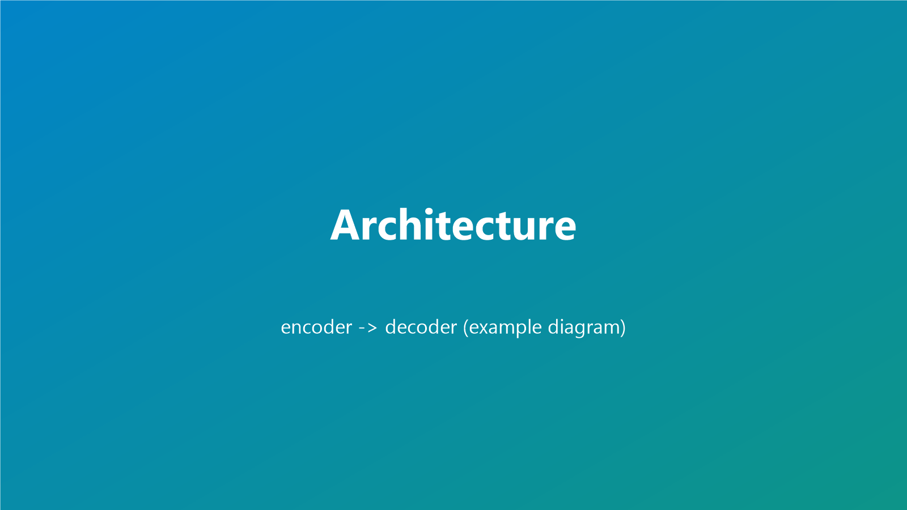

+++
title = "예시: 논문 정리 템플릿"
date = 2026-07-27T10:00:00+09:00
draft = false
tags = ["논문정리", "예시", "template"]
categories = ["논문"]
summary = "새 글을 쓸 때 이 구조를 복사해서 내용만 바꾸면 됩니다. front matter·커버·이미지·shortcode·코드·표 사용법을 한 글에 담은 예시입니다."

[cover]
  image = "cover.png"
  alt = "예시 커버 이미지"
  caption = "커버 이미지는 front matter의 [cover] 로 지정합니다"
  relative = true
+++

> 📌 이 글은 **작성 방법을 보여주는 템플릿**입니다.
> 새 글을 쓸 땐 `content/posts/<새-slug>/` 폴더를 만들고 이 `index.md` 구조를 복사해
> 내용만 바꾸세요. 이미지는 **같은 폴더**에 넣고 파일명만 참조하면 됩니다.

## 폴더 구조 (page bundle)

```text
content/posts/paper-note-template/
├── index.md          ← 지금 이 파일
├── cover.png         ← 커버 (front matter [cover])
├── fig-arch.png      ← 본문 그림
└── fig-results.png   ← 본문 그림
```

front matter 맨 위 `+++ ... +++` 안에 제목·날짜·태그·요약을 씁니다.
`date` 가 미래면 빌드에서 제외되니 주의하세요.

## 한 줄 요약

한 문단으로 "이 논문이 무엇을, 어떻게, 왜 잘하는지"를 적습니다. (예시 텍스트)

## 배경 / 왜 읽었나

- 기존 방법의 한계: (예시)
- 이 논문이 풀려는 문제: (예시)

## 핵심 아이디어

### 방법 1 — 마크다운 상대경로 이미지

원본 그대로 넣고 싶을 때는 평범한 마크다운 문법을 씁니다.



### 방법 2 — 리사이즈 shortcode (권장)

큰 스크린샷·그래프는 `img` shortcode 로 넣으면 **1200px로 축소 + WebP 변환**되어
페이지가 가벼워집니다. 캡션도 붙일 수 있습니다.



## 방법 상세

핵심 수식이나 알고리즘은 코드블록으로 정리하면 하이라이팅이 됩니다.

```python
def loss(pred, target):
    # 예시: scale-invariant depth loss
    d = torch.log(pred) - torch.log(target)
    return (d ** 2).mean() - 0.5 * (d.mean() ** 2)
```

비교 표는 마크다운 표를 씁니다.

| 방법 | AbsRel ↓ | δ<1.25 ↑ | 비고 |
|------|:-------:|:--------:|------|
| Baseline | 0.110 | 0.88 | (예시) |
| 제안 방법 | **0.085** | **0.93** | (예시) |

## 결과



- 관찰 1: (예시)
- 관찰 2: (예시)

## 메모 / 링크

- 내 생각: (한계, 재현 여부, 적용 아이디어 등)
- 원문: [arXiv 링크 자리](https://arxiv.org/)
- 코드: [GitHub 링크 자리](https://github.com/)
