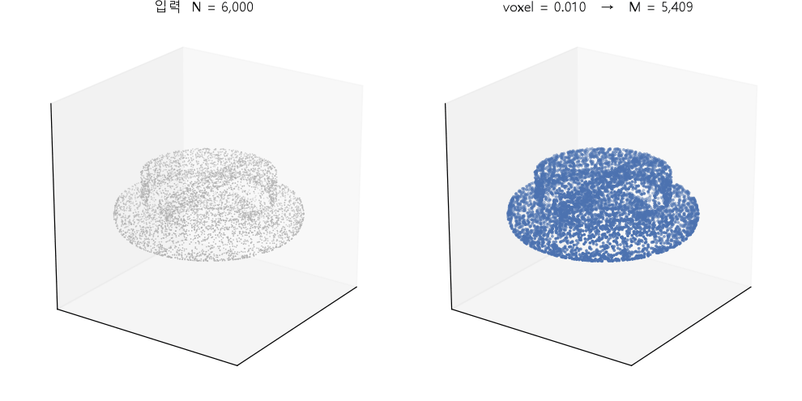
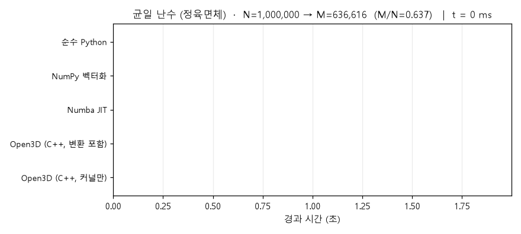
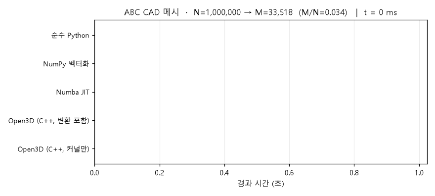
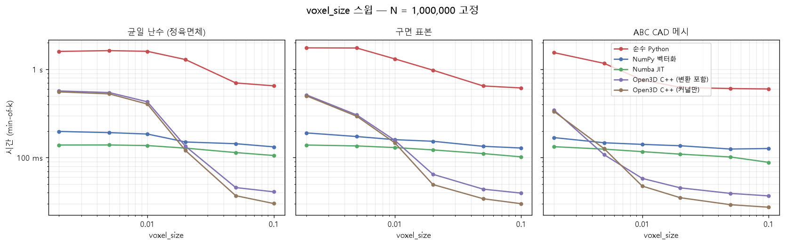
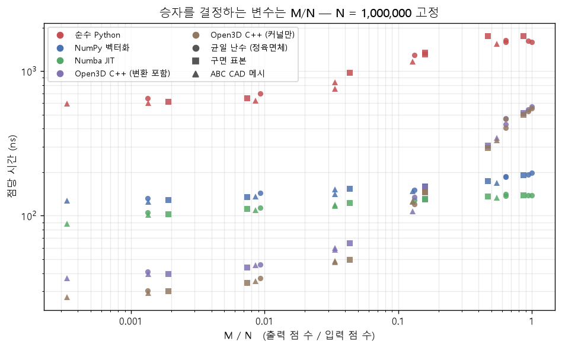
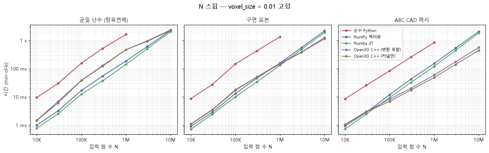

+++
title = "voxel down-sampling: C++가 항상 빠른 게 아니다 — 승자를 결정하는 건 M/N"
date = 2026-07-28T19:55:00+09:00
draft = false
tags = ["point-cloud", "벤치마크", "numba", "open3d", "numpy", "최적화"]
categories = ["프로그램"]
summary = "voxel down-sampling 을 순수 Python·NumPy·Numba·Open3D(C++) 네 가지로 구현해 같은 결과가 나오는지 먼저 검증한 뒤 속도를 재봤다. 결론은 '언어'가 아니었다. 출력 점 수와 입력 점 수의 비 M/N 이 0.1 보다 크면 Numba 가 C++ 를 최대 3.3배 앞서고, 작으면 C++ 가 2.5배 앞선다. 정렬 기반 구현의 비용은 N 에만, 해시맵 기반 구현의 비용은 M 에 달려 있기 때문이다."

[cover]
  image = "fig_collapse.png"
  alt = "M/N 대 점당 시간 — 세 데이터셋이 구현별로 한 곡선에 모인다"
  caption = "승자를 결정하는 변수는 데이터 종류가 아니라 M/N 이다"
  relative = true
+++

> 🛠 재현 코드: `D:\playground\voxel-sampling-bench`
> `python test_equivalence.py` → `python bench.py` → `python plot_bench.py` → `python animate.py`
>
> ⚠️ **이 글은 언어 비교가 아니다.** `open3d.voxel_down_sample` 은 C++ 해시 그리드 구현이고
> numba 버전은 내가 쓴 루프다. 둘의 차이에는 언어·알고리즘·자료구조가 섞여 있다.
> 그래서 **같은 알고리즘의 네 가지 구현**을 비교했고, 비교 전에 네 구현이 같은 결과를 내는지 먼저 확인했다.

## 한 줄 요약

"C++ 가 빠르다"를 확인하려고 시작했는데 **틀렸다.** 승자는 언어가 아니라
**M/N — 출력 점 수 ÷ 입력 점 수**로 갈렸다. M/N 이 0.1 보다 크면 Numba 가 Open3D C++ 를
최대 3.3배 앞서고, 0.1 보다 작으면 Open3D 가 2.5배 앞선다. 세 데이터셋에서 교차점이 일관됐다.

## voxel down-sampling 이 하는 일

공간을 정육면체 격자로 자르고, 각 칸에 들어온 점들을 **평균 한 점**으로 합친다.
`voxel_size` 를 키우면 칸이 커지고 남는 점이 줄어든다.



왼쪽이 입력(N=6,000), 오른쪽이 결과(M). ABC 데이터셋 CAD 메시 표면에서 표본한 점군이다.
여기서 이미 이 글의 핵심 변수가 보인다 — **voxel_size 하나로 M 이 수천에서 수십으로 바뀐다.**

## 네 가지 구현

| 구현 | 방식 |
|---|---|
| 순수 Python | dict 기반 루프. 기준선 |
| NumPy 벡터화 | 복셀 좌표 → 선형 키 → `np.unique` + `bincount` |
| Numba JIT | 같은 알고리즘을 `@njit` 로. **단일 스레드** |
| Open3D | `voxel_down_sample`. Python↔C++ 변환 비용 포함 |
| Open3D (커널만) | 변환을 뺀 순수 C++ 커널 시간 |

NumPy 구현에서 한 가지 주의할 점이 있다. `np.unique(idx, axis=0)` 은 void-view lexsort 를 써서
느리다. 그걸 쓰면 **구현 차이가 언어 차이로 오해된다.** 3D 복셀 좌표를 int64 선형 키로 인코딩한 뒤
1D `np.unique` 를 쓰면 numba 구현과 같은 알고리즘이 된다.

```python
lo = idx.min(axis=0)
span = idx.max(axis=0) - lo + 1
rel = idx - lo
key = (rel[:, 2] * span[1] + rel[:, 1]) * span[0] + rel[:, 0]   # 3D → 1D
_, inverse = np.unique(key, return_inverse=True)
```

## 먼저 할 일: 네 구현이 같은 결과를 내는가

**결과가 다른 구현끼리 속도를 비교하면 벤치마크 전체가 무효다.** 이게 이 글에서 가장 중요한 단계였다.

Open3D 를 기준으로 맞춰야 할 규칙이 두 개 있었다.

1. 복셀 격자 원점이 `min_bound` 가 아니라 **`min_bound - voxel_size * 0.5`** 다.
2. 각 복셀의 대표점은 그 안에 든 점들의 **평균**이다 (복셀 중심이 아니다).

이 둘을 맞추자 결과가 일치했다. 점 순서는 구현마다 다르므로 정렬 후 비교한다.

```
[uniform] N=20000 voxel=0.05 → M=7938
  PASS python vs open3d: max|Δ|=0.00e+00
  PASS numpy  vs open3d: max|Δ|=0.00e+00
  PASS numba  vs open3d: max|Δ|=3.33e-16
```

numba 만 `~1e-16` 차이가 나는데, 부동소수 합산 **순서**가 달라서 생기는 값이다. 나머지는 완전 일치.

## 측정 방법 — 여기서 한 번 실패했다

처음에는 반복 5회의 **중앙값**을 대표값으로 썼다. 그런데 구면 데이터의 `voxel_size=0.02` 한 점에서
모든 구현이 동시에 느려지는 이상점이 나왔다. 재측정하니 **이상점이 재현되지 않고 다른 곳으로 옮겨갔다** —
numba 가 238ms → 528ms, 순수 Python 이 1206ms → 2606ms. `중앙값/최솟값` 비가 최대 1.81 이었다.

알고리즘 효과가 아니라 **머신의 간헐적 외부 부하**였다. 중앙값은 이걸 흡수하지 못한다.

그래서 대표값을 **min-of-k** 로 바꾸고 반복을 9회로 올렸다. 최솟값은 "경합 없는 시간"의 추정값이고
`timeit` 의 기본 관행이다. 다시 측정한 189개 행 중 `중앙값/최솟값 > 1.3` 인 행은 4개뿐이었고,
**그 4개가 전부 순수 Python 행**이었다. 가장 오래 걸리는 구현이 부하 창을 만날 확률이 가장 높으니
앞뒤가 맞는다.

그 밖의 원칙:
- **첫 호출은 버린다** — 안 하면 numba JIT 컴파일 시간이 섞여 numba 가 훨씬 느려 보인다.
- **네 구현 모두 단일 스레드다.** numba 에 `parallel=True` 를 쓰지 않았다.
  단 **Open3D 내부 스레딩은 확인하지 않았다.**
- 순수 Python 은 N ≤ 10⁶ 만 측정했다. 그 위는 분 단위라 생략하고 CSV 에 `skipped` 로 남겼다.

## 결과 1 — 예상이 뒤집혔다

N = 10⁶, `voxel_size` = 0.01 에서 같은 코드, 같은 설정, 데이터만 바꿨다.

| 데이터 | M/N | 순수 Python | NumPy | **Numba** | **Open3D (커널)** |
|---|---|---|---|---|---|
| 균일 난수 (정육면체) | 0.637 | 1637 ms | 187 ms | **142 ms** | 469 ms |
| 구면 표본 | 0.158 | 1341 ms | 158 ms | **131 ms** | 145 ms |
| ABC CAD 메시 | 0.034 | 839 ms | 152 ms | 120 ms | **49 ms** |

균일 난수에서는 **Numba 가 C++ 보다 3.3배 빠르고**, ABC 메시에서는 **C++ 가 Numba 보다 2.5배 빠르다.**
데이터만 바꿨는데 승자가 뒤집힌다.





## 결과 2 — 원인은 M/N 이다

`voxel_size` 를 훑으면 구조가 드러난다.



- **NumPy·Numba 는 거의 평평하다.** 정렬이 지배하고, 정렬 비용은 N 에만 달려 있다. `voxel_size` 를
  50배 키워도 138ms → 106ms 정도로만 줄어든다.
- **Open3D 는 급격히 내려간다.** 해시맵에 들어가는 키 개수가 곧 M 이므로, 비용이 M 에 달려 있다.
  균일 난수에서 555ms → 30ms, **18배** 차이다.

그래서 두 곡선은 반드시 한 번 교차한다. 이걸 M/N 축에 놓으면 세 데이터셋이 한 곡선으로 모인다.



Numba(초록)는 M/N 이 0.0003 에서 1 까지 3천 배 변하는 동안 점당 90~140ns 로 거의 평평하다.
Open3D(갈색)는 30ns 에서 550ns 로 **18배** 올라간다. 데이터 종류(마커 모양)로는 갈리지 않고
M/N(가로축)으로만 갈린다.

교차점은 세 데이터셋에서 일관됐다.

| 데이터 | Numba 가 이긴 마지막 M/N | Open3D 가 이긴 첫 M/N |
|---|---|---|
| 균일 난수 | 0.637 | 0.132 |
| 구면 표본 | 0.159 | 0.044 |
| ABC CAD 메시 | 0.128 | 0.034 |

**교차점은 M/N ≈ 0.04 ~ 0.16 구간**이다. N=10⁷ 균일 난수(M/N=0.103)에서 Numba 2047ms 대
Open3D 커널 2260ms 로 거의 동률인 것도 이 값과 맞는다.

## 결과 3 — 파이썬에서 느린 건 언어가 아니라 루프다

그리고 원래 확인하려던 것.



순수 Python 대비:

| 구현 | 균일 난수 | 구면 | ABC |
|---|---|---|---|
| NumPy 벡터화 | 8.8배 | 8.5배 | 5.5배 |
| Numba JIT | 11.6배 | 10.3배 | 7.0배 |
| Open3D C++ (커널) | 3.5배 | 9.3배 | 17.2배 |

**같은 알고리즘을 NumPy 로 벡터화하는 것만으로 C++ 와 같은 자리에 온다** (구면에서 158 vs 145ms).
파이썬이 느린 게 아니라 **파이썬 인터프리터 루프**가 느린 것이다. 루프를 없애면 언어 페널티는
거의 사라지고, 남는 것은 알고리즘 선택(정렬 대 해시맵)의 차이다.

한 가지 더: **Python↔C++ 변환 비용은 N 에 비례한다.** 10⁶ 점에서 3~11ms 로 절대값은 작지만,
커널이 빠를수록 비중이 커져서 ABC 메시에서는 전체 60ms 중 11ms — **19%** 였다.
Open3D 를 여러 번 호출하는 파이프라인이면 `PointCloud` 를 재사용해야 한다.

## 실무 정리

| 상황 | 선택 |
|---|---|
| voxel 이 작아 점이 별로 안 줄어든다 (M/N > 0.2) | **Numba** 또는 NumPy |
| voxel 이 커서 점이 크게 줄어든다 (M/N < 0.05) | **Open3D** |
| 애매한 구간 (M/N ≈ 0.1) | 아무거나. 차이 없다 |
| Open3D 를 반복 호출 | `PointCloud` 객체를 재사용해 변환 비용 제거 |
| numpy 만 쓸 수 있는 환경 | `np.unique(axis=0)` 대신 **선형 키 인코딩** |

M/N 을 미리 모르면 `voxel_size` 와 점군의 대략적 부피로 추정할 수 있다. 표면 점군이면
M ≈ 표면적 / voxel_size² 다.

## 남은 것 (확인하지 않음)

정직하게 밝혀둘 한계들이다.

- **Open3D 내부 스레딩을 확인하지 않았다.** 단일 스레드라고 가정하지 않았고, 검증도 안 했다.
  만약 멀티스레드라면 "C++ 대 Numba" 비교에 스레드 수 차이가 섞여 있다.
- **`parallel=True` numba 버전을 만들지 않았다.** 정렬을 병렬화하면 M/N 이 큰 구간에서
  격차가 더 벌어질 것으로 예상되지만 측정하지 않았다.
- 교차점 M/N ≈ 0.1 은 **이 CPU 에서**의 값이다. 캐시 크기가 다르면 옮겨갈 수 있다.
- ABC 메시는 1개만 썼다. 메시별 편차를 재지 않았다.

## 환경

```
CPU     Intel64 Family 6 Model 151 (20 threads)
OS      Windows 11 (10.0.26100)
Python  3.12.13
numpy   2.4.6    numba 0.66.0    open3d 0.19.0
```

> Open3D 0.19.0 은 **cp312 까지만** 휠을 제공한다. Python 3.13 에서는 설치되지 않아
> 3.12 전용 env 를 따로 만들어야 했다.
